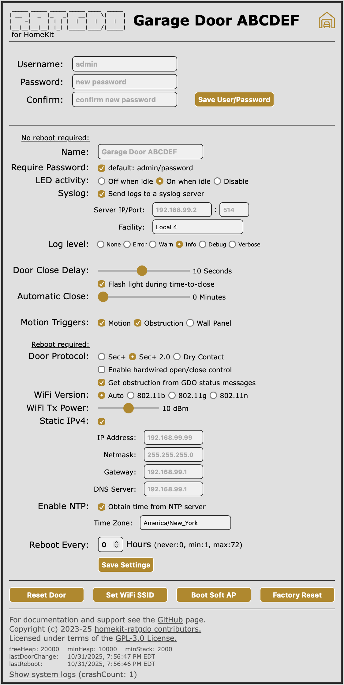
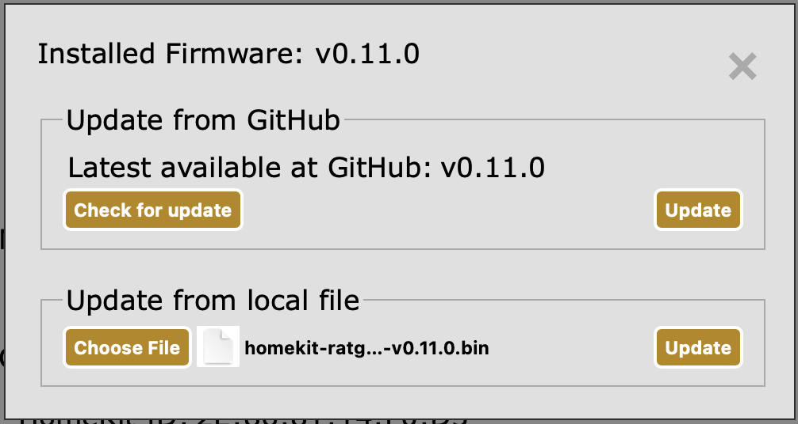

# What is HomeKit-RATGDO?

HomeKit-RATGDO is an alternative firmware for the RATGDO v2.5-series WiFi control boards that works
over your _local network_ using HomeKit, or over the internet using your Apple HomeKit home hubs, to
control your garage door opener. It requires no supporting infrastructure such as Home Assistant,
Homebridge, MQTT, etc, and connects to your garage door opener with as few as three wires.

This firmware supports only Security+ 2.0-enabled garage door openers and RATGDO v2.5-series
ESP8266-based hardware.

> [!IMPORTANT]
> As of release v1.0.0, we believe this code is stable enough to call this a release build. You may
> still encounter issues.  Please review the [Issues](https://github.com/ratgdo/homekit-ratgdo/issues)
> and open a new one if necessary.
>
> See the section below on where to get help.
> 
> I am pretty sure it won't leave your garage open to thieves and light your cat on fire, but it
> might. If your happiness depends on your garage door working every time, [consider using an
> alternative](https://thenewwazoo.github.io/bye-bye-ratgdo.html#whats-next).

## What does this firmware support?

* Opening and closing multiple garage doors independently in the same HomeKit home.
* Light Control and Status
* Obstruction sensor reporting
* Motion sensor reporting, if you have a "smart" wall-mounted control panel.

That's it, for now. Check the [GitHub Issues](https://github.com/ratgdo/homekit-ratgdo/issues) for
planned features, or to suggest your own.

## How do I install it?

> [!NOTE]
> The installation process is still being improved. You may need to reload the flasher tool page
> after each of the following steps in order to proceed.

For each of the following steps, use the [online browser-based flash tool](https://ratgdo.github.io/homekit-ratgdo/flash.html):

* Install the HomeKit-RATGDO firmware, and then *wait 20 seconds*.
* Connect the RATGDO to WiFi
* Click "Visit Device", and then begin the process of adding a device to HomeKit. Scan the QR code,
  or manually enter the setup code `2510-2023`.

That's it!

## Using ratgdo Webpage

In [v0.9.0](https://github.com/ratgdo/homekit-ratgdo/releases/tag/v0.9.0), an updated webpage was added.

[](#webpage)

### How to secure webpage?

Since the [first release](https://github.com/ratgdo/homekit-ratgdo/releases/tag/v0.9.0) of the new webpage, in [v0.11.0](https://github.com/ratgdo/homekit-ratgdo/releases/tag/v0.11.0) a login was added to protect the wepage.  By default authentication is not required, but it is strongly recommended that you enable the setting to require a password and change the default.

#### Default Username/Password: `admin`/`password`

You can change the default password by clicking into the settings gear:

[](#settings)

and input a new password. Saving a new password will return you to the main webpage.
[](#password)

On this page you can also select the garage door protocol, either Sec+ or Sec+ 2.0 (default) and whether a userid/password is required.  Saving these settings will cause the ratgdo device to restart and return to the main webpage. 

## How do I upgrade?

In [v0.8.0](https://github.com/ratgdo/homekit-ratgdo/releases/tag/v0.8.0), Over-the-Air (OTA) updates were added. Follow the steps below to update:

With [v0.11.0](https://github.com/ratgdo/homekit-ratgdo/releases/tag/v0.11.0) a second option was added to upgrade directly from Github.
You can either
- Update from Github
    - To check for updates, click `Check for update`
    - If update is available, Click `Update`
[](#ota)
- Update from local file
    - Download the latest release, by download the `.bin` file on the [latest release](https://github.com/ratgdo/homekit-ratgdo/releases)
[](#firmware)
    - Navigate to your ratgdo's ip address where you will see the devices webpage, Click `Firmware Update`
[](#webpage)
    - Upload the firmware that was downloaded in step 1, by clicking `Choose File` under `Update from local file`.
[](#ota)
    - Click `Update` to proceed with upgrading
[](#uploaded)
    - Once the update is Successful, ratgdo will now Reboot
    - After a firmware update, you _may_ have to go through the process of re-pairing your device to HomeKit.  If your device is showing up as unresponsive in HomeKit, please try un-pairing, reboot, and re-pairing.

Automatic updates are not supported (and probably will never be), so set a reminder to check back
again in the future.

## Help! aka the FAQs

### How can I tell if the ratgdo is paired to HomeKit?

Use the [online browser-based flash tool](https://ratgdo.github.io/homekit-ratgdo/flash.html), and follow the
"Visit Device" link. If you see a big QR code, the ratgdo is *not* paired.

### I added my garage door in the Home app but can't find it

This is a common problem. Be sure to check all of the "rooms" in the Home app. If you really can't
find it, you can try un-pairing and re-pairing the device, paying close attention to the room you
select after adding it.

### How do I re-pair my ratgdo?

Use the [online browser-based flash tool](https://ratgdo.github.io/homekit-ratgdo/flash.html), and follow the
"Visit Device" link. If you see a big QR code, the ratgdo is *not* paired. Click the "Un-pair
HomeKit" button, and then delete the garage door from within the HomeKit app (or vice versa, order
does not matter). It is also recommended that you reboot the RATGDO after un-pairing.  You can then re-pair the
device by adding it again as normal.

### Where can I get help?

If your question has not been answered here, you can try the Discord chat.

Click [this link](https://discord.gg/homebridge-432663330281226270) to follow an invite to the
server. Server rules require a 10 minute wait after signup.

Now that you've signed up, go here to join the discussion:

[](https://discord.com/channels/432663330281226270/1184710180563329115).

Please also feel free to open a [GitHub Issue](https://github.com/ratgdo/homekit-ratgdo/issues) if
you don't already see your concern listed. Don't forget to check the [closed
issues](https://github.com/ratgdo/homekit-ratgdo/issues?q=is%3Aissue+is%3Aclosed) to see if someone
has already found a fix.

## How can I contribute?

HomeKit-RATGDO uses [PlatformIO](https://platformio.org/platformio-ide) for builds. You'll want to
install PlatformIO first.

After you've checked out this repo:

```
git clone git@github.com:ratgdo/homekit-ratgdo.git
```

Initialize the submodules from the root of the repo:

```
cd homekit-ratgdo
git submodule init lib/secplus/
git submodule update
```

The [`x.sh`](https://github.com/ratgdo/homekit-ratgdo/blob/main/x.sh) script is my lazy way of not
having to remember PlatformIO-specific `pio` commands. The important ones are `run`, `upload`, and
`monitor`.

## Who wrote this?

This firmware was written by [Brandon Matthews](https://github.com/thenewwazoo), with lots of
inspiration from the [esphome-ratgdo](https://github.com/ratgdo/esphome-ratgdo) project and critical
dependence on the [secplus decoder library](https://github.com/argilo/secplus).

Special credit goes to the Chamberlain Group, without whose irredeemably stupid decision to [close
their API to third
parties](https://chamberlaingroup.com/press/a-message-about-our-decision-to-prevent-unauthorized-usage-of-myq),
this firmware would never have been necessary.

[Garage icons](https://www.flaticon.com/free-icons/garage) created by Creative Squad - Flaticon
